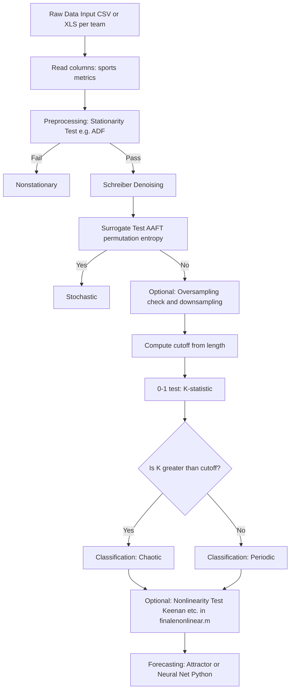

This repository contains MATLAB and Python files for analyzing and visualizing chaotic behavior, nonlinearity, and forecasting.

## Pipeline Overview

The analysis pipeline runs: **Raw Data** → **Preprocessing (Schreiber denoising)** → **Chaos detection (0-1 test, surrogate test)** → **Forecasting (Attractor/Neural net)**. Optional nonlinearity tests (e.g. Keenan) run on denoised data via `finalenonlinear.m`.

For implementation parameters (embedding delay, cutoff, Schreiber defaults, etc.) and justification of the feature-engineering choices, see [README_TECHNICAL.md](README_TECHNICAL.md).

## Getting Started

### 1. Check for Chaos
- Open MATLAB.
- Run the code in **`phasechaos.m`**.
- **Important:** Make sure **`chaos_modified.m`** is in the **same folder** as `phasechaos.m`.

### 2. Check for Nonlinearity
- Open MATLAB.
- Run the code in **`finalenonlinear.m`** to analyze the nonlinearity in your data/system.

### 3. Forecasting
- Open **`runcode.ipynb`** in Jupyter Notebook or any compatible Python environment.
- Execute the cells to run the forecasting code.

### 4. Plot Chaotic Behavior
- Open **`compare2.ipynb`** in Jupyter Notebook.
- Run the cells to generate the chaotic plots.

## Requirements

- **MATLAB** (for `.m` files)
- **Python 3.x** with Jupyter Notebook (for `.ipynb` files)
- Ensure you have all necessary MATLAB toolboxes and Python libraries (e.g., NumPy, Matplotlib) installed before running the scripts.
