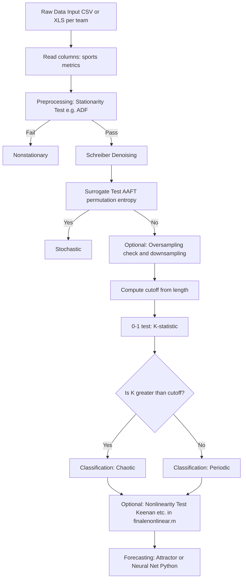

This repository contains MATLAB and Python files for analyzing and visualizing chaotic behavior, nonlinearity, and forecasting.

## Pipeline Overview

The analysis pipeline runs: **Raw Data** → **Preprocessing (Schreiber denoising)** → **Chaos detection (0-1 test, surrogate test)** → **Forecasting (Attractor/Neural net)**. Optional nonlinearity tests (e.g. Keenan) run on denoised data via `finalenonlinear.m`.

For implementation parameters (embedding delay, cutoff, Schreiber defaults, etc.) and justification of the feature-engineering choices, see [README_TECHNICAL.md](README_TECHNICAL.md). For ready-to-insert manuscript revision content (peer review response: P1–P6), see [MANUSCRIPT_REVISION_CONTENT.md](MANUSCRIPT_REVISION_CONTENT.md).

### Configuration
- **`chaos_config.m`** defines the 14 sports-metric column names and folder paths used by `phasechaos.m` and `finalenonlinear.m`. By default, paths are relative: `data/raw` (raw CSVs), `data/results` (chaos results), `data/denoised` (denoised CSVs), `data/nonlinear_results` (Keenan etc.). Create these folders or edit `chaos_config.m` to set your own paths.

### Key files and scripts

| File | Role |
|------|------|
| **MATLAB/Octave** | |
| `chaos_config.m` | Shared config: 14 metrics, paths (`data/raw`, `data/results`, `data/denoised`, `data/nonlinear_results`). |
| `phasechaos.m` | Batch driver: reads CSVs from `data/raw`, runs `chaos_modified` per column, writes results and denoised CSVs. |
| `chaos_modified.m` | Core pipeline: stationarity, Schreiber denoising, surrogate (AAFT) + permutation entropy, 0-1 test. |
| `finalenonlinear.m` | Runs nonlinearity tests (Keenan, Ramsey, Teräsvirta, Tsay) on denoised CSVs. |
| `run_chaos_octave.m` | Octave-only driver: loads `data/processed/clean_game.csv`, filters Team 52, runs `chaos_modified`. Use when MATLAB is not installed. |
| `prove_hypothesis.m` | Chaos vs Random baseline for five teams (52, 6, 14, 19, 24); writes `data/results/prove_hypothesis_results.txt` and `prove_hypothesis_summary.csv`. Run with Octave. |
| **Python** | |
| `process_data_folder.py` | Standardizes CSVs to Date, HomeTeam, AwayTeam, FTHG, FTAG; reads from a folder (e.g. `data/raw`), writes to `data/processed/` (e.g. `clean_game.csv`). |
| `compute_LLE_reviewer6.py` | Largest Lyapunov Exponent (LLE) for Team 52; prints Reviewer #6 chaos sentence; saves to `data/results/LLE_reviewer6_results.txt`. Requires NumPy. |
| `run_LLE_test_cases.py` | Runs LLE test cases (Team 52 FTHG/FTAG, Teams 6/14/19 FTHG, logistic map, white noise); saves to `data/results/LLE_test_*.txt` and `LLE_test_cases_summary.txt`. |
| `validate_LLE_results.py` | Validates LLE (logistic map, white noise, Team 52 vs 0-1 test); writes `data/results/LLE_validation_report.txt`. |
| `validate_prove_hypothesis.py` | Validates prove_hypothesis summary CSV; writes `data/results/prove_hypothesis_validation_report.txt`. |
| **Documentation** | |
| [README_TECHNICAL.md](README_TECHNICAL.md) | Methodology-to-code table (§1), pipeline flowchart (§2), feature-engineering justification (§3). |
| [MANUSCRIPT_REVISION_CONTENT.md](MANUSCRIPT_REVISION_CONTENT.md) | Ready-to-insert manuscript text (P1–P6) for peer review. |
| [HYPOTHESIS_PROOF.md](HYPOTHESIS_PROOF.md) | Full hypothesis proof H1–H6 with evidence and verdicts; points to `data/results/` artifacts. |
| [docs/REVIEW_RESPONSE.md](docs/REVIEW_RESPONSE.md) | Hypothesis answers and point-by-point response to Associate Editor and Reviewers 1, 3, 5, 6. |
| [docs/README.md](docs/README.md) | Documentation index: REVIEW_RESPONSE, hypothesis summary, results layout, quick commands. |
| [CONTEXT_FOR_AGENT.md](CONTEXT_FOR_AGENT.md) | Context for new agents: repo overview, key files, data layout, quick commands. |
| [test_cases_LLE_reviewer6.md](test_cases_LLE_reviewer6.md) | Test-case doc for LLE and Reviewer #6 text (NHL, synthetic). |
| [REVISION_CHECKLIST.md](REVISION_CHECKLIST.md) | Resubmission checklist: P1–P6, rebuttal items, evidence to generate. |
| [DATA_AVAILABILITY.md](DATA_AVAILABILITY.md) | Dataset citations, Data availability statement template, how to cite code. |

### Data layout
- **`data/raw/`** — Raw CSVs (e.g. NHL `game.csv`). Place team CSVs here or set paths in `chaos_config.m`.
- **`data/processed/`** — Output of `process_data_folder.py` (e.g. `clean_game.csv`: Date, HomeTeam, AwayTeam, FTHG, FTAG).
- **`data/results/`** — Chaos classification, LLE outputs, prove_hypothesis results, validation reports (e.g. `chaos_classification_results.txt`, `LLE_reviewer6_results.txt`, `prove_hypothesis_summary.csv`, `prove_hypothesis_validation_report.txt`, `hypothesis_proof_summary.txt`).
- **`data/denoised/`** — Denoised CSVs from `phasechaos.m`; input for `finalenonlinear.m`.
- **`data/nonlinear_results/`** — Output of `finalenonlinear.m`.

## Getting Started

### 1. Process raw data (optional)
- Run **`python3 process_data_folder.py data/raw`** to produce **`data/processed/clean_game.csv`** (Date, HomeTeam, AwayTeam, FTHG, FTAG). Use this for LLE and prove_hypothesis scripts.

### 2. Check for Chaos
- **MATLAB:** Place team CSV files in **`data/raw`** (or set `cfg.folder_raw` in `chaos_config.m`). Run **`phasechaos.m`**. Ensure **`chaos_modified.m`** and **`chaos_config.m`** are in the same folder.
- **Octave (no MATLAB):** Run **`octave run_chaos_octave.m`** to load `clean_game.csv`, filter Team 52, and run `chaos_modified` for 0-1 classification. Results go to `data/results/`.

### 3. LLE and Reviewer #6
- **`python3 compute_LLE_reviewer6.py`** — LLE for Team 52; prints Reviewer #6 chaos sentence; saves to `data/results/LLE_reviewer6_results.txt`.
- **`python3 run_LLE_test_cases.py`** — All LLE test cases (teams + synthetic); saves to `data/results/LLE_test_*.txt` and `LLE_test_cases_summary.txt`.
- **`python3 validate_LLE_results.py`** — Validates LLE (logistic map, white noise, Team 52); writes `data/results/LLE_validation_report.txt`.

### 4. Chaos vs Random baseline (prove hypothesis)
- **`octave prove_hypothesis.m`** — Runs Chaos vs Random baseline for teams 52, 6, 14, 19, 24; writes `data/results/prove_hypothesis_results.txt` and `prove_hypothesis_summary.csv`.
- **`python3 validate_prove_hypothesis.py`** — Validates prove_hypothesis summary; writes `data/results/prove_hypothesis_validation_report.txt`.

### 5. Check for Nonlinearity
- Open MATLAB. Run **`finalenonlinear.m`** on denoised data (reads from `data/denoised` by default; requires `chaos_config.m` and `NonlinTst`).

### 6. Forecasting
- Open **`runcode.ipynb`** in Jupyter Notebook or any compatible Python environment.
- Execute the cells to run the forecasting code.

### 7. Plot Chaotic Behavior
- Open **`compare2.ipynb`** in Jupyter Notebook.
- Run the cells to generate the chaotic plots.

## Requirements

- **MATLAB** (for `.m` files) or **Octave** (for `run_chaos_octave.m`, `prove_hypothesis.m`)
- **Python 3.x** with Jupyter Notebook (for `.ipynb` files) and NumPy (for LLE scripts)
- Ensure you have all necessary MATLAB toolboxes and Python libraries (e.g., NumPy, Matplotlib) installed before running the scripts.
