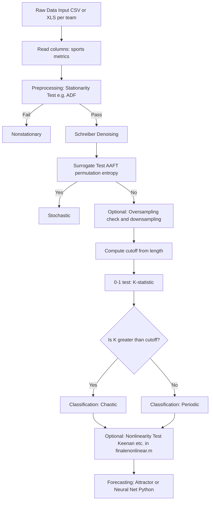

# Technical Documentation (Methods & Peer Review)

This document provides methodology-to-code mapping, pipeline flowchart, and justification of feature engineering for the chaos-theory analysis pipeline. It is suitable for insertion into a paper Methods section or a Rebuttal Letter.

---

## 1. Methodology-to-Code Table (Reviewer #5)

The following table maps scientific parameters to the exact MATLAB implementation. **Note:** In the **main** chaos classification path, embedding dimension is **not** determined by False Nearest Neighbors (FNN). The 0-1 test is used without phase-space reconstruction. FNN is used **only** inside the surrogate data generator when the method is PPS or TS, via `embedsig(...,'DimAlg','fnn')`.

| Scientific Concept | MATLAB Variable / Location | Default Value / Calculation Method | Code Reference |
|--------------------|----------------------------|------------------------------------|----------------|
| **Embedding delay** | `tau` in `phasespace(x,dim,tau)` | Default `1` if not provided | `chaos_modified.m` lines 682–695, 704 |
| **Embedding dimension** | `dim` in `phasespace(x,dim,tau)` | Default `2` if not provided; in Schreiber denoising, `K+L+1` = 3 (K=1, L=1) | `chaos_modified.m` lines 666–678, 541 (noiserSchreiber: K=1, L=1 at 455–486) |
| **Embedding dimension (FNN)** | `embedsig(sig,'DimAlg','fnn')`; output `m` | Computed dynamically by FNN when surrogate method is PPS or TS | `chaos_modified.m` lines 991–998 (PPS), 1041–1047 (TS) |
| **Schreiber denoising** | `noiserSchreiber(x,K,L,r,repeat,auto)` | K=1, L=1, r=std(x), repeat=1 (defaults when called with one argument); then `y(10:end-10)` applied | `chaos_modified.m` lines 92–98 (call), 405–489 (function), 488–499 (r default) |
| **K-statistic cutoff** | `cutoff` | Dynamic: `0.00005455 * length(y) + 0.422`, capped at 0.99 | `chaos_modified.m` lines 217–221 |
| **0-1 test noise (Dawes–Freeland)** | `sigma` | Fixed default 0.5 | `chaos_modified.m` lines 51–52, 231 (`z1test(y, sigma)`) |
| **Permutation entropy** | `petropy(y,n,tau,method,accu)` | For output: n=5, tau=1. For surrogate comparison: n=8, tau=1. Method/accu use internal defaults | `chaos_modified.m` line 223 (output); lines 150, 165, 186 (surrogate); function at 249 |
| **Keenan / nonlinearity tests** | `NonlinTst(y)` | Returns Ramsey, Keenan, Terasvirta, Tsay p-values (external/toolbox implementation) | `finalenonlinear.m` lines 49–56 |

---

## 2. Algorithmic Flowchart (Reviewer #3)

Execution pipeline from raw data to chaos classification and forecasting:

---

## 3. Feature Engineering Justification (Reviewer #6)

The pipeline does **not** combine the 14 sports metrics (e.g. FTGoalsFor, FTGoalsAgainst, TeamGS, TeamGC, TeamPoints, MatchWeek, TeamFormPts, WinStreak3, WinStreak5, LossStreak3, LossStreak5, TeamGD, TeamDiffPts, TeamDiffFormPts) into a single ad hoc formula. Instead, each metric is treated as a **separate univariate time series** and is passed through the same preprocessing and chaos-detection steps (stationarity test, Schreiber denoising, surrogate test, 0-1 test). This design constitutes a **multi-metric validation** strategy: it uses a fixed set of domain-standard performance and outcome variables, avoids arbitrary weighting or composite indices that would require additional justification, and is appropriate for **small or moderate sample sizes** where high-variance sports data would otherwise be over-fit by a single composite. The K-statistic cutoff is **data-length-dependent** (linear in N with a cap), which reduces sensitivity to sample size. Keeping one dimension per series preserves interpretability and aligns with standard practice in nonlinear time-series analysis where phase-space reconstruction, when used (e.g. inside Schreiber denoising or in surrogate generation), benefits from a clear per-variable interpretation. If a composite “performance index” (e.g. an equation such as Eq. 4 in the manuscript) is introduced in the text, it should be defined explicitly and implemented in code so that the methodology-to-code mapping remains unambiguous.
