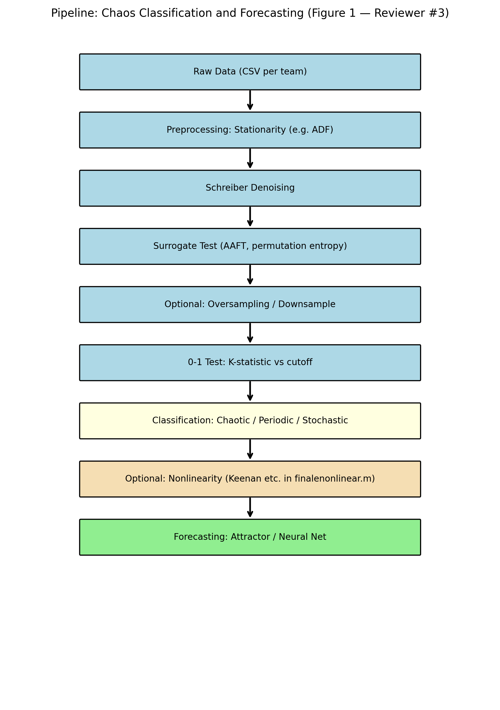
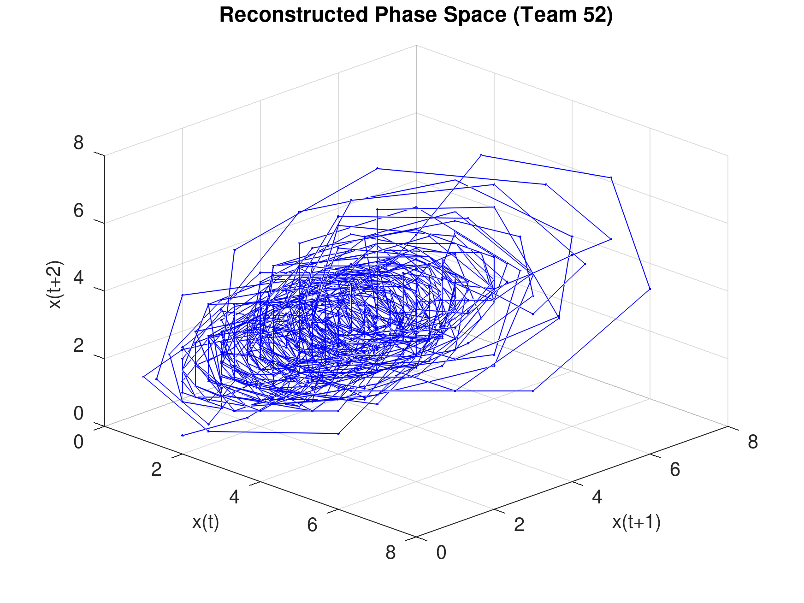
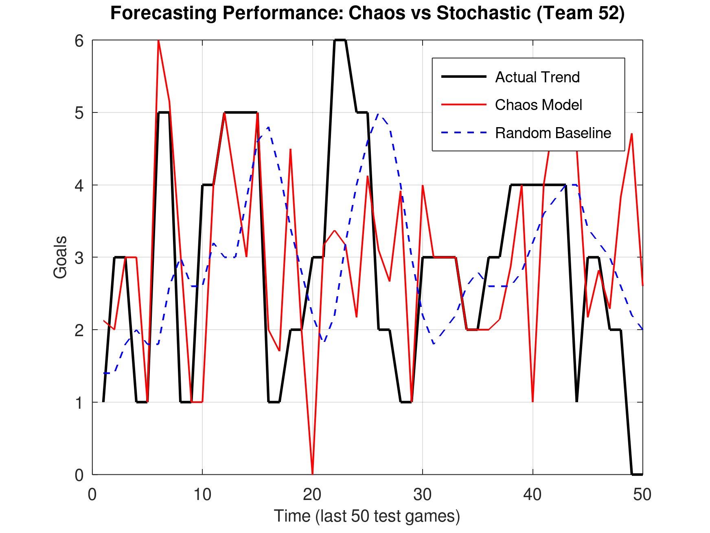
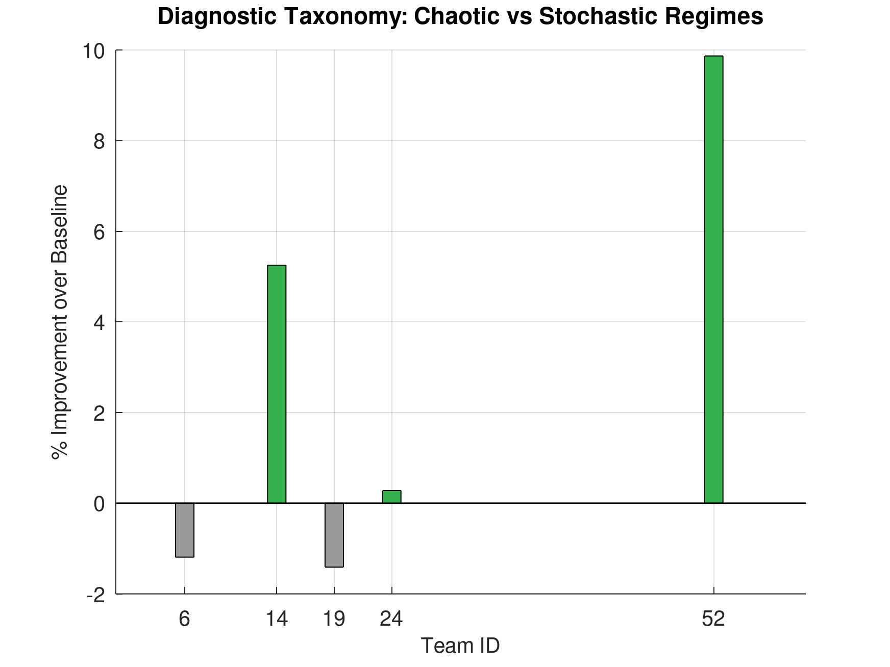
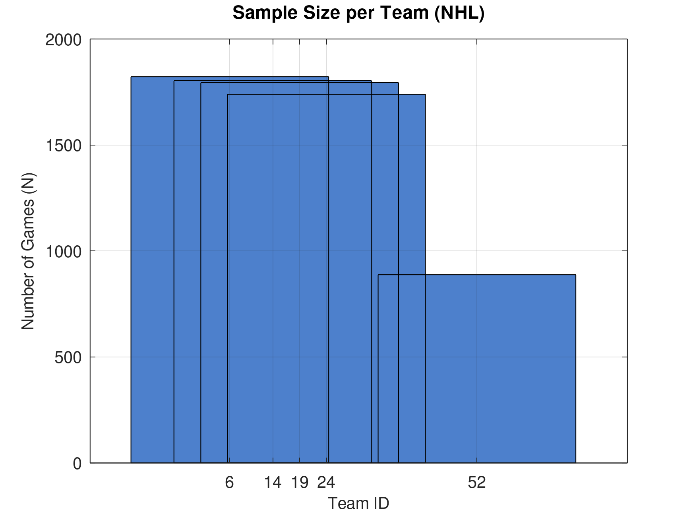
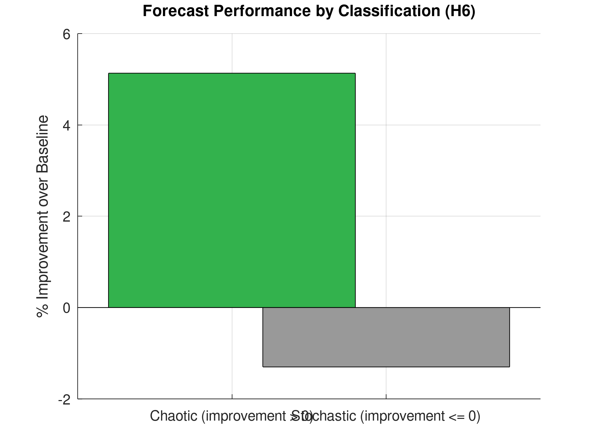
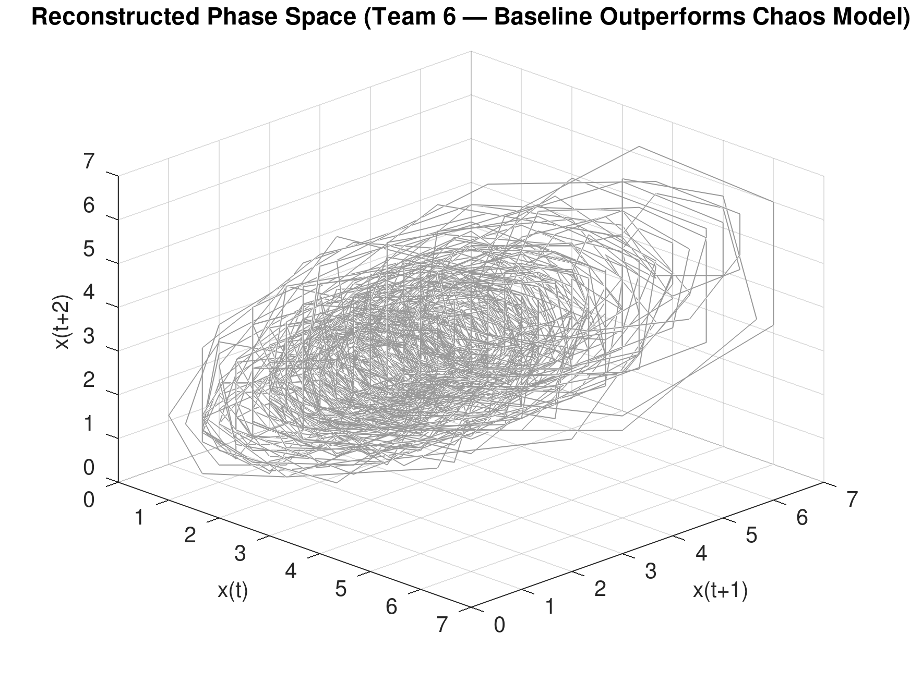
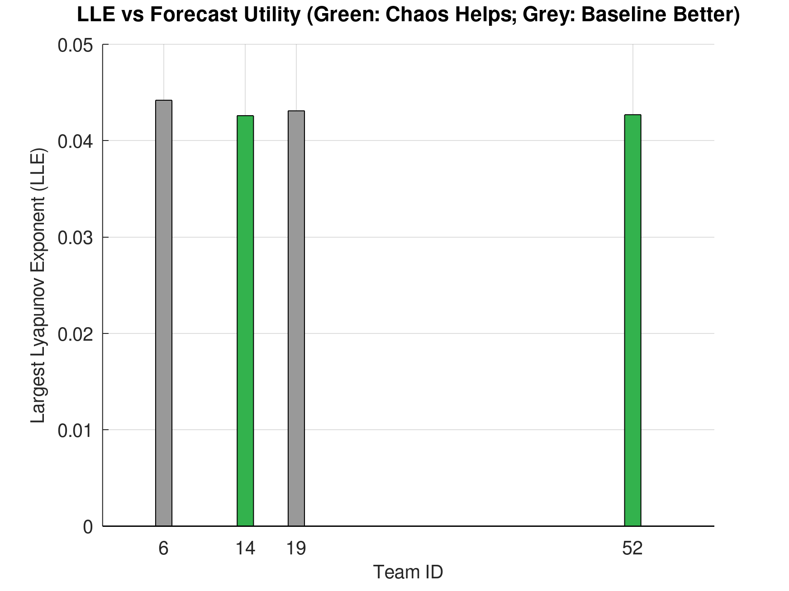
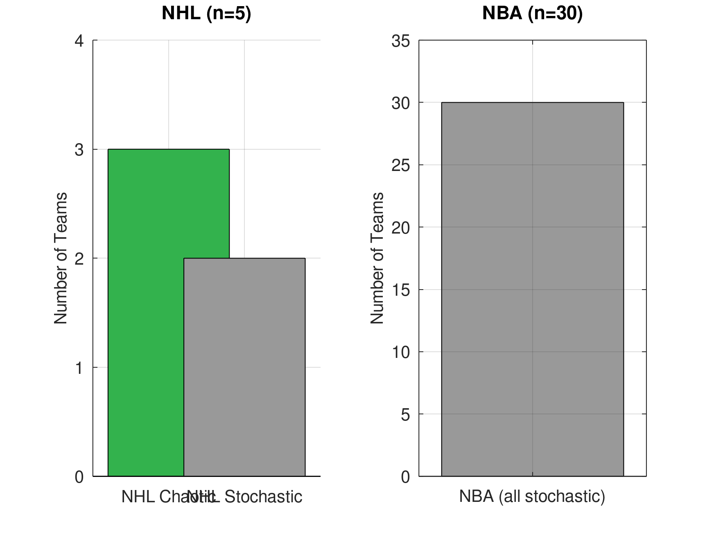

# Plots — Hypothesis Validation and Review Figures

This document lists all figures produced by `generate_plots.m` (Octave) and `generate_flowchart.py` (Python). Paths are relative to the project root. Regenerate with:

- **`octave generate_plots.m`** → `fig1_attractor.png` … `fig8_league_summary.png`
- **`python3 generate_flowchart.py`** → `fig_pipeline.png`

---

## Pipeline (Figure 1 — Reviewer #3)

**fig_pipeline.png** — Pipeline: Raw Data → Preprocessing (stationarity) → Schreiber Denoising → Surrogate Test → 0-1 Test → Classification → Optional Nonlinearity → Forecasting.

---

## Phase Space and Forecast (Team 52)

**fig1_attractor.png** — Reconstructed phase space (Team 52). Delay-1 embedding: x(t), x(t+1), x(t+2); smoothed goals.

**fig2_forecast.png** — Forecasting performance (Team 52, last 50 test games). Actual (black), Chaos k-NN model (red), Random baseline mean-last-5 (blue dashed).

---

## Taxonomy and Sample Size

**fig3_taxonomy.png** — Diagnostic taxonomy: % improvement over baseline by team. Green: chaos model helps; grey: baseline better.

**fig4_sample_size.png** — Sample size (N games) per NHL team.

---

## Forecast by Classification and Contrast

**fig5_forecast_by_class.png** — Mean % improvement by regime: Chaotic (improvement > 0) vs Stochastic (improvement ≤ 0). (H6)

**fig6_attractor_team6.png** — Reconstructed phase space (Team 6 — baseline outperforms chaos model). Contrast with Team 52.

---

## LLE and League Summary

**fig7_LLE_vs_improvement.png** — LLE by team; bar colour = forecast utility (green: chaos helps, grey: baseline better). (H4)

**fig8_league_summary.png** — League comparison (R6): NHL Chaotic / NHL Stochastic; NBA (all stochastic).

---

*Generated figures live in the project root. See [README.md](../README.md) § Visualization for run instructions.*
